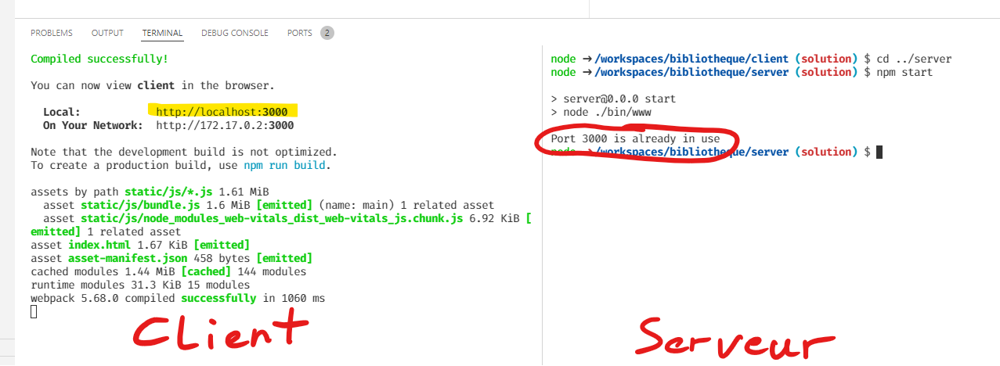

# Développer une appli React avec un backend express.js

Lorsque nous développons une application web avec React pour le client et Express.js pour le serveur, nous utilisons 2 serveurs :

* Un serveur backend Express.js qui, par défaut, reçoit les requêtes sur le port TCP 3000;
* Un serveur de développement React.js qui reçoit les requêtes sur le port TCP 3000 aussi.

Comme vu en bases des réseaux, deux serveurs ne peuvent pas écouter sur le même port TCP en même temps.
C'est donc le premier serveur démarré qui gagne.
Lorsque l'on essaye de démarrer le second, un erreur s'affiche comme sur la capture d'écran ci-dessous.



**La solution est simple : il faut qu'un des 2 serveurs utilise un autre port !**

## Changer le port du backend

Pour changer le port utilisé par le serveur express.js, il faut créer une variable d'environnement `PORT`.
Cette variable est utilisée à la ligne 15 du fichier [server/bin/www](https://github.com/EAFC-Uccle-PROJWEB2-S1-2122/bibliotheque-froland/blob/main/server/bin/www) :

```JavaScript
const port = normalizePort(process.env.PORT || '3000');
```

Voyons les différentes options pour que le serveur backend express.js démarre sur le port 4000.

### Dans un terminal *Windows PowerShell*

```PowerShell
$Env:PORT=4000
npm start
```

### Dans un terminal *Windows Command-Line*

```
set PORT=4000
npm start
```

### Dans un terminal *Linux* ou *Mac OS X*

```Shell
PORT=4000 npm start
```

### Dans le debugger de *Visual Studio Code*

C'est l'option que j'ai utilisée lors de la démo "bibliotheque".

Ajouter la variable d'environnement dans le fichier [.vscode/launch.json](https://github.com/EAFC-Uccle-PROJWEB2-S1-2122/bibliotheque-froland/blob/main/.vscode/launch.json).

```YAML
{
  configurations": [
    {
      "env": {
        "PORT": "4000"
      }
    }
  ]
}
```
